DOM IN JS

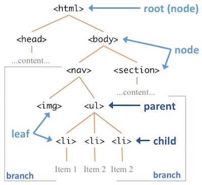

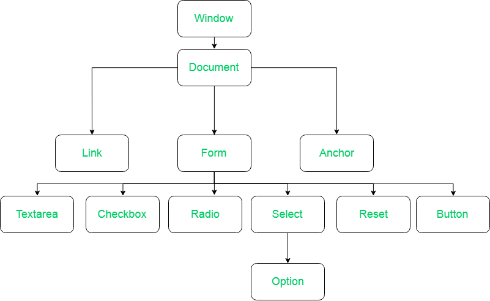

```Methods of Document Object:

write(“string”): Writes the given string on the document.

getElementById(): returns the element having the given id value.

getElementsByName(): returns all the elements having the given name value.

getElementsByTagName(): returns all the elements having the given tag name.

getElementsByClassName(): returns all the elements having the given class name.
```

```
<table>
	<ROWS>
		<tr>
			<td>Car</td>
			<td>Scooter</td>
		</tr>
		<tr>
			<td>MotorBike</td>
			<td>Bus</td>
		</tr>
	</ROWS>
</table>

```

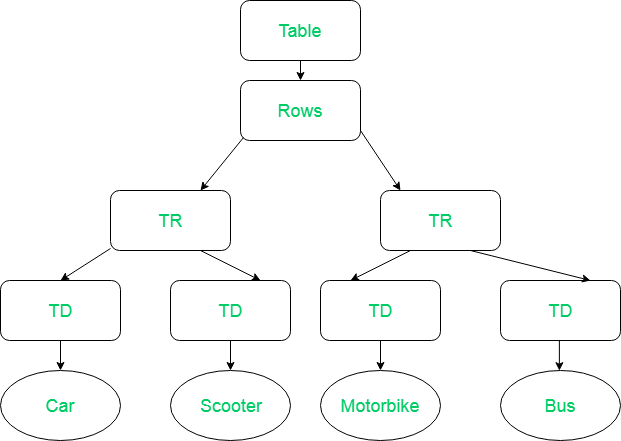

# DOM: Document Object Model

**Document: the document that we are talking about is the html document.**

```
<html>
<<head></head>
<title></title>
<body></body>
</html>

```

```
Script tag :

Browser fetch the html page.

Begins parsing the html.

While parsing it encounters a script tag refering to external file.

Browser request the external file and block the parser, Hence parsing of html is halted.

Once the script is downloaded, it is executed subsequently and parser restarted.
```

# DOCUMENT :

**All the DOM properties available to us via browser.**

# Methods in DOM:

```
<!DOCTYPE html>
<html lang="en">
  <head>
    <meta charset="UTF-8" />
    <meta name="viewport" content="width=device-width, initial-scale=1.0" />
    <title>Document</title>
  </head>
  <body>
    <h1 id="top-main-text" class="hello-all-header">Hello, all</h1>

    <ul id="listOfItem " class="hello-all-header">
      <li>Hello,everyone</li>
      <li>Hello,everyone</li>
      <li>Hello,everyone</li>
      <li>Hello,everyone</li>
      <li>Hello,everyone</li>
    </ul>

    <p class="para">How are you1,</p>
    <h1 id="parag">How are you2,</h1>
    <h2 class="paragr">How are you3,</h2>
    <h4 class="">How are you4,</h4>

    <div class="paragraph">Hi,Tanu1</div>
    <div class="paragraph">Hi,Tanu2</div>
    <div class="paragraph">Hi,Tanu3</div>
    <div class="paragraph">Hi,Tanu4</div>
    <div class="paragraph">Hi,Tanu5</div>

    <br />
    <input type="text" name="geeks" placeholder="Enter Your Name" />
    <br />
    <br />
    <input type="text" name="geeks" placeholder="Enter Contact details" />
    <script src="index.js"></script>
  </body>
</html>


```

**1. getElementById() :**

```
<!DOCTYPE html>
<html lang="en">
  <head>
    <meta charset="UTF-8" />
    <meta name="viewport" content="width=device-width, initial-scale=1.0" />
    <title>Document</title>
  </head>
  <body>
    <h1 id="top-main-text" class="hello-all-header">Hello, all</h1>

    <ul id="listOfItem " class="hello-all-header">
      <li>Hello,everyone</li>
      <li>Hello,everyone</li>
      <li>Hello,everyone</li>
      <li>Hello,everyone</li>
      <li>Hello,everyone</li>
    </ul>

    <p class="para">How are you1,</p>
    <h1 id="parag">How are you2,</h1>
    <h2 class="paragr">How are you3,</h2>
    <h4 class="">How are you4,</h4>

    <div class="paragraph">Hi,Tanu1</div>
    <div class="paragraph">Hi,Tanu2</div>
    <div class="paragraph">Hi,Tanu3</div>
    <div class="paragraph">Hi,Tanu4</div>
    <div class="paragraph">Hi,Tanu5</div>

    <br />
    <input type="text" name="geeks" placeholder="Enter Your Name" />
    <br />
    <br />
    <input type="text" name="geeks" placeholder="Enter Contact details" />
    <script src="index.js"></script>
  </body>
</html>

```

```
 document.getElementById("top-main-text").style.color="red";

o/p:
```

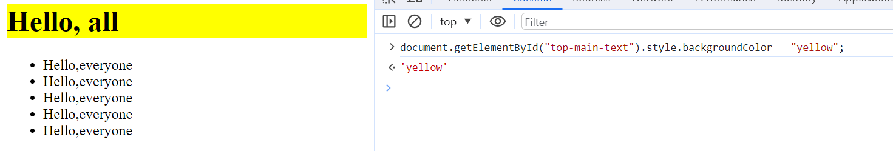

```a. document.getElementById("top-main-text").style.cssText = "color:red; font-size:100px; letter-spacing:10px";```

**o/p:**

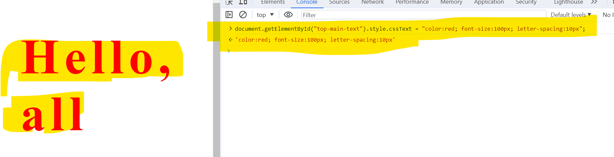

***2. getElementByClassName():**

```
<!DOCTYPE html>
<html lang="en">
  <head>
    <meta charset="UTF-8" />
    <meta name="viewport" content="width=device-width, initial-scale=1.0" />
    <title>Document</title>
  </head>
  <body>
    <h1 id="top-main-text" class="hello-all-header">Hello, all</h1>

    <ul id="listOfItem " class="hello-all-header">
      <li>Hello,everyone</li>
      <li>Hello,everyone</li>
      <li>Hello,everyone</li>
      <li>Hello,everyone</li>
      <li>Hello,everyone</li>
    </ul>

    <p class="para">How are you1,</p>
    <h1 id="parag">How are you2,</h1>
    <h2 class="paragr">How are you3,</h2>
    <h4 class="">How are you4,</h4>

    <div class="paragraph">Hi,Tanu1</div>
    <div class="paragraph">Hi,Tanu2</div>
    <div class="paragraph">Hi,Tanu3</div>
    <div class="paragraph">Hi,Tanu4</div>
    <div class="paragraph">Hi,Tanu5</div>

    <br />
    <input type="text" name="geeks" placeholder="Enter Your Name" />
    <br />
    <br />
    <input type="text" name="geeks" placeholder="Enter Contact details" />
    <script src="index.js"></script>
  </body>
</html>

```

```
  document.getElementByClassName("hello-all-header")

   or
   const element = document.getElementByClassName("hello-all-header");
   element.style.color="red";
   console.log(element);

   o/p:
```

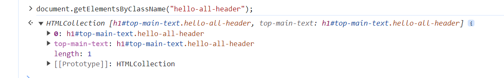

3. getElementsByName():

   ```
   <!DOCTYPE html>
   <html lang="en">
   <head>
    <meta charset="UTF-8" />
    <meta name="viewport" content="width=device-width, initial-scale=1.0" />
    <title>Document</title>
   </head>
   <body>
    <h1 id="top-main-text" class="hello-all-header">Hello, all</h1>

    <ul id="listOfItem " class="hello-all-header">
      <li>Hello,everyone</li>
      <li>Hello,everyone</li>
      <li>Hello,everyone</li>
      <li>Hello,everyone</li>
      <li>Hello,everyone</li>
    </ul>

    <p class="para">How are you1,</p>
    <h1 id="parag">How are you2,</h1>
    <h2 class="paragr">How are you3,</h2>
    <h4 class="">How are you4,</h4>

    <div class="paragraph">Hi,Tanu1</div>
    <div class="paragraph">Hi,Tanu2</div>
    <div class="paragraph">Hi,Tanu3</div>
    <div class="paragraph">Hi,Tanu4</div>
    <div class="paragraph">Hi,Tanu5</div>

    <br />
    <input type="text" name="geeks" placeholder="Enter Your Name" />
    <br />
    <br />
    <input type="text" name="geeks" placeholder="Enter Contact details" />
    <script src="index.js"></script>
   </body>
   </html>

   ```

```
const ele = document.getElementByName("geeks");
console.log(ele);

console.log(ele[0]);
console.log(ele[1]);
o/p:

```

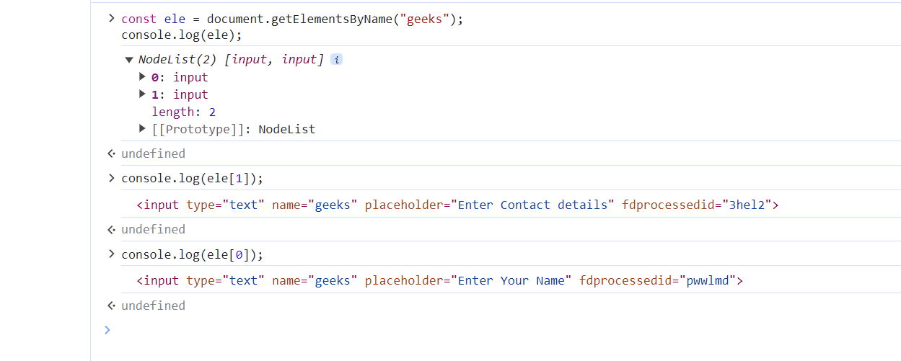

**1. getElementsByTagName():**

```
const ele = document.getElementsByTagName("p");

console.log(ele[0]);
console.log(ele[1]);
console.log(ele[2]);
console.log(ele[3]);
console.log(ele[4]);

o/p:


```

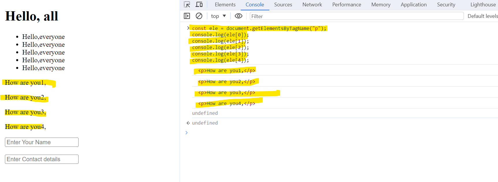

**5. querySelector() :**

```
<!DOCTYPE html>
<html lang="en">
  <head>
    <meta charset="UTF-8" />
    <meta name="viewport" content="width=device-width, initial-scale=1.0" />
    <title>Document</title>
  </head>
  <body>
    <h1 id="top-main-text" class="hello-all-header">Hello, all</h1>

    <ul id="listOfItem " class="hello-all-header">
      <li>Hello,everyone</li>
      <li>Hello,everyone</li>
      <li>Hello,everyone</li>
      <li>Hello,everyone</li>
      <li>Hello,everyone</li>
    </ul>

    <p class="para">How are you1,</p>
    <h1 id="parag">How are you2,</h1>
    <h2 class="paragr">How are you3,</h2>
    <h4 class="">How are you4,</h4>

    <div class="paragraph">Hi,Tanu1</div>
    <div class="paragraph">Hi,Tanu2</div>
    <div class="paragraph">Hi,Tanu3</div>
    <div class="paragraph">Hi,Tanu4</div>
    <div class="paragraph">Hi,Tanu5</div>

    <br />
    <input type="text" name="geeks" placeholder="Enter Your Name" />
    <br />
    <br />
    <input type="text" name="geeks" placeholder="Enter Contact details" />
    <script src="index.js"></script>
  </body>
</html>

```

```
const ele = document.querySelector(".para");
   const elem = document.querySelector("#parag");
   const eleme = document.querySelector("para");

console.log(ele,elem,eleme);

o/p :


```

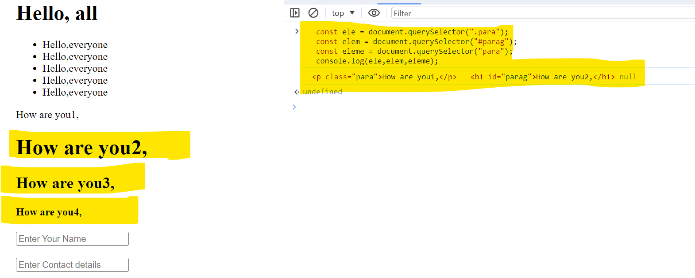

**6. querySelectorAll() :**

```
<!DOCTYPE html>
<html lang="en">
  <head>
    <meta charset="UTF-8" />
    <meta name="viewport" content="width=device-width, initial-scale=1.0" />
    <title>Document</title>
  </head>
  <body>
    <h1 id="top-main-text" class="hello-all-header">Hello, all</h1>

    <ul id="listOfItem " class="hello-all-header">
      <li>Hello,everyone</li>
      <li>Hello,everyone</li>
      <li>Hello,everyone</li>
      <li>Hello,everyone</li>
      <li>Hello,everyone</li>
    </ul>

    <p class="para">How are you1,</p>
    <h1 id="parag">How are you2,</h1>
    <h2 class="paragr">How are you3,</h2>
    <h4 class="">How are you4,</h4>

    <div class="paragraph">Hi,Tanu1</div>
    <div class="paragraph">Hi,Tanu2</div>
    <div class="paragraph">Hi,Tanu3</div>
    <div class="paragraph">Hi,Tanu4</div>
    <div class="paragraph">Hi,Tanu5</div>

    <br />
    <input type="text" name="geeks" placeholder="Enter Your Name" />
    <br />
    <br />
    <input type="text" name="geeks" placeholder="Enter Contact details" />
    <script src="index.js"></script>
  </body>
</html>

```

```
 const divs = document.querySelectorAll("paragraph");
   console.log(divs);

o/p:


```

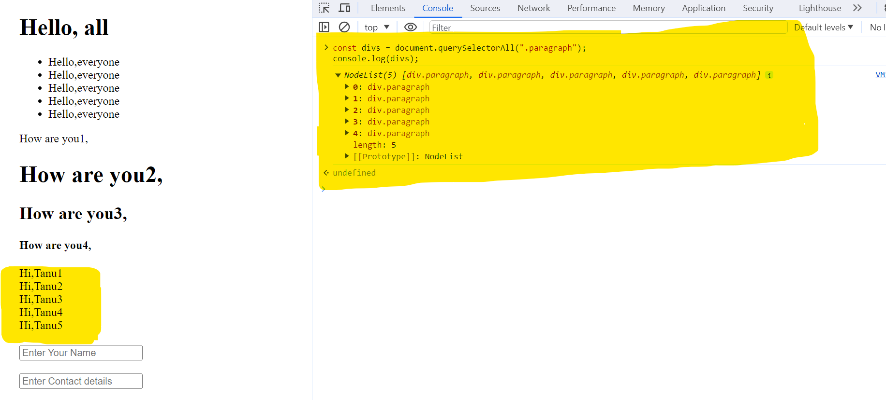

**7. innerHTML():**

   o/p:
   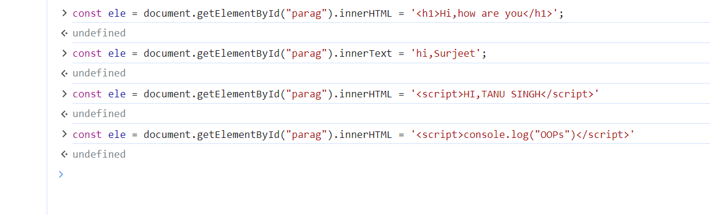

**8. innerText():**

o/p:
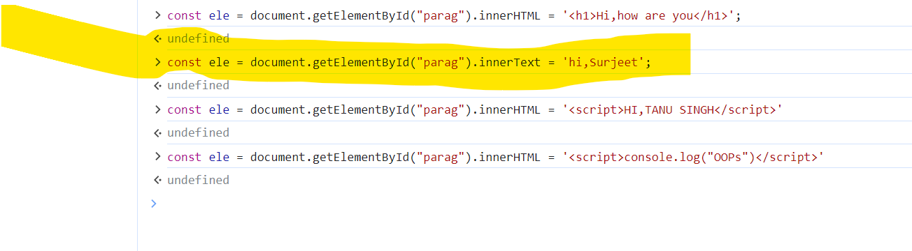

**9. createElement():**

   o/p:
   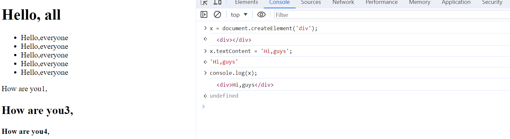

**10. textContent() :**

o/p:


**11. How to create element inside div?**

o/p: 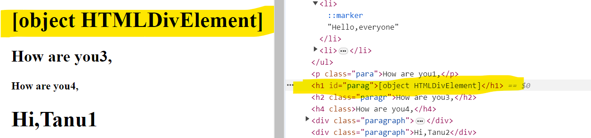

    o/p:
    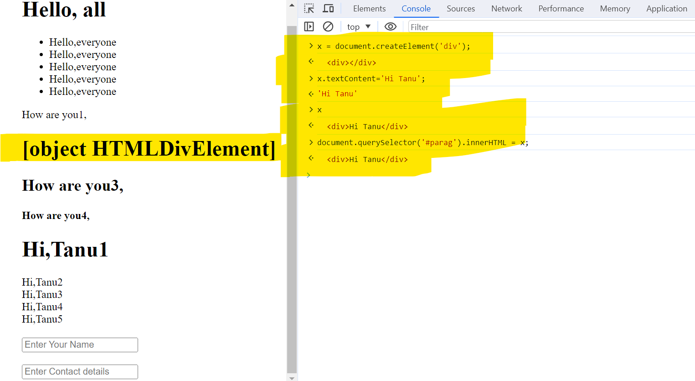

**12. appendChild() and prepend() :**

o/p:


o/p:
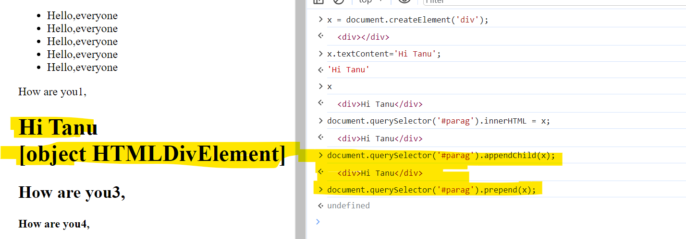
