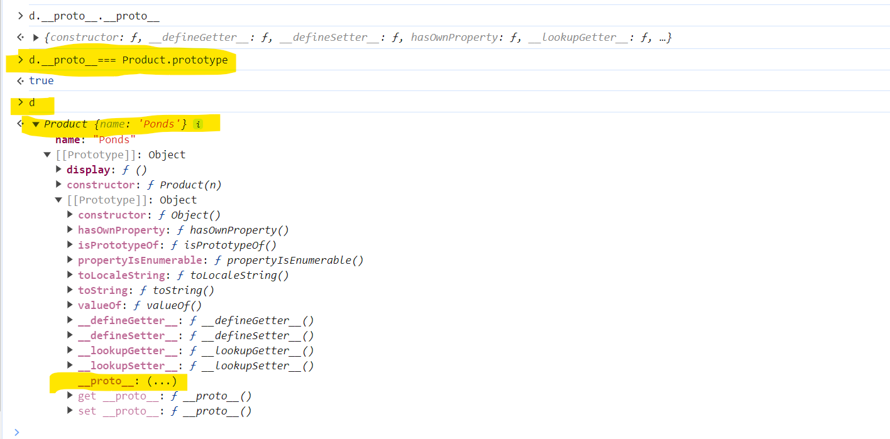

**Class Keyword**
You can create blueprint
e.g.

```js
class <name>{
    ---- Properties |
    ----            |
                      -> we can create real life entities
    ---- Behaviour  |    to create and manage the entities
    ----            |    "new" , "this"
}

```

# ProtoType in JavaScript

**Prototypes :**
Object are created by constructor calls using new keyword

classes : Blueprint
Object : Instances

**what is Prototypes?**

It is a mechanism using which JS objects inherits features from one another.


**Every object has a Prototypes property with itself.**

```js
function Product(n) {
  this.name = n;
}
let d = new Product("Android");

// after creating object we can add data member and member function

Product.prototype.display = function () {
  console.log("name of the product is", this.name);
};
Product.prototype.show = function () {
  console.log("show me your profile picture", this.name);
};
```


**Hidden Relationship**


`Dunder Proto : __proto__`




# Inheritance in JS :

```js
function A(){}
undefined

function B(){}
undefined

new A();

A {}

[[Prototype]]: Bconstructor: ƒ A()[[Prototype]]: Object

new B();

B {}

[[Prototype]]: Objectconstructor: ƒ B()[[Prototype]]: Object

Object.setPrototypeOf(A.prototype,B.prototype);


```


