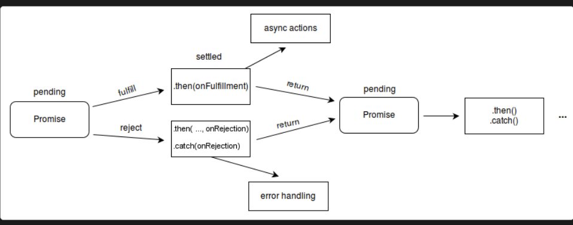
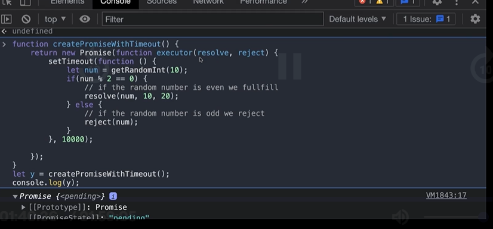
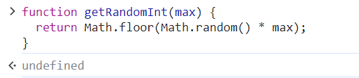
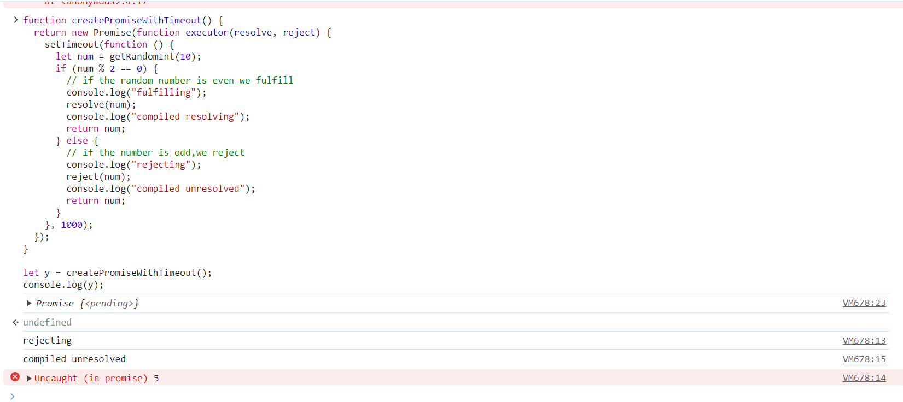

``` 1. What is Promises in JavaScript?
   -> Readiblity Enhances
   -> They can solve the problem of Inversion of Control (IOC).

2. In JS, Promises are special type of objects that get returned immediately when we call them.

3. Promises acts a placeholder for the data we hope to get back sometime in future.

Placeholder: when you are purchasing new car ,a car has a placeholder with no number.

x= fetch(url: "http://www.xyz.com")
|
|
v
Assume fetch is written using promises then, it will immediately return a promise object which will act as a placeholder.

-> In these promises objects we can attach the functionality we want to execute once the future task is done.

-> Once the future task is done,promises will automatically execute the attached functionality.
```
```js
setTimeout(exec,2000);

fetch("http://www.xyz.com,function exec(){
console.log("done);
})

```
```
- How to create a promise?
- How can we consume a promise?

---
```
- How to create a promise?
- Creation of a promise object is sync in nature.
- 1. Pending : when we create a new promise object this is the default state. It represent work in progress.

There are 3 state:
1.Fulfilled
2.Rejected
3.Pending

- Fulfilled : if the operation is completed successfully
- Rejected : if the operation is not successful.
- Pending(fulfilled,rejected)
```

```
 ------- Promise -------
1.May be we fulfill the promise 2. May be we do not fulfill the promises. ```


```
```js
Syntax of Promise(executer function call ):
new Promise(f) :the constructor expects a callback

new Promise(function(resolve,reject){
resolve(x)

<!-- Inside the function we can write over -->
<!-- time consuming time -->

})
```
```
Example:

```js
const myPromise = new Promise((resolve, reject) => {
setTimeout(() => {
resolve("foo");
}, 300);
});

myPromise
.then(handleFulfilledA, handleRejectedA)
.then(handleFulfilledB, handleRejectedB)
.then(handleFulfilledC, handleRejectedC);
```
```
1. What is Resolve, Reject and Pending State?

   -> Whenever in the implementation of executer callback you call the resolve function,the promise goes to a fulfilled state.

   -> if you call reject function, it goes to a rejected state and if you don't call anything, promise remains in pending state.

-> With whatever argument we call resolve or reject with gets assigned to the value property.

Example:
```






```
Promises constructor :  1. value : default -> undefined
           2. State : default -> Pending
new Promise(function exec(resolve,reject){

})

1. At the time, when the constructor generates a new promises object, it also generates a pair of function, called as resolve & reject.
2. Generally, the executor callback, wraps some async/sync operation.
3. The executor is called sync.

```
