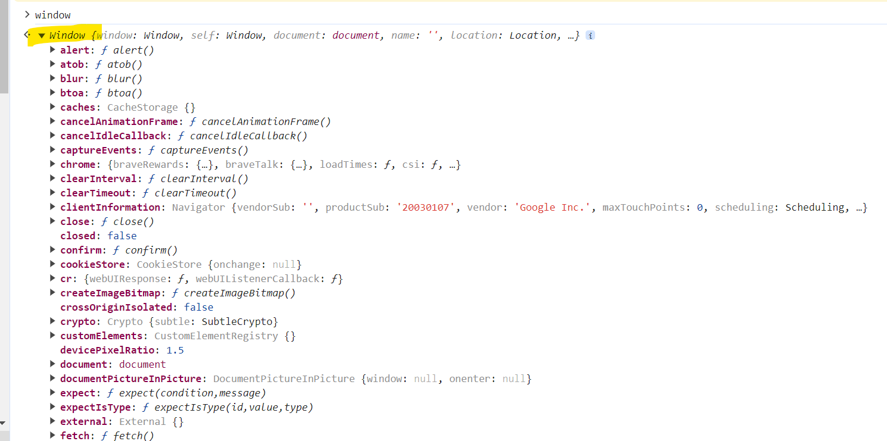
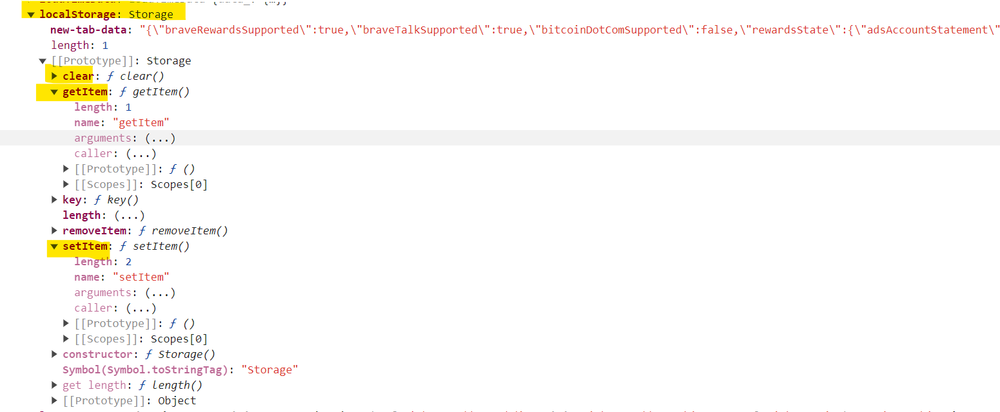
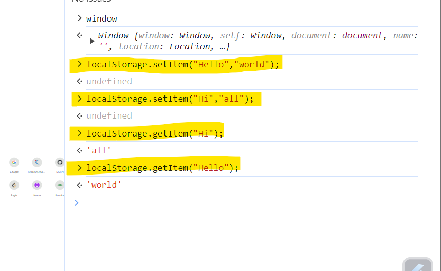
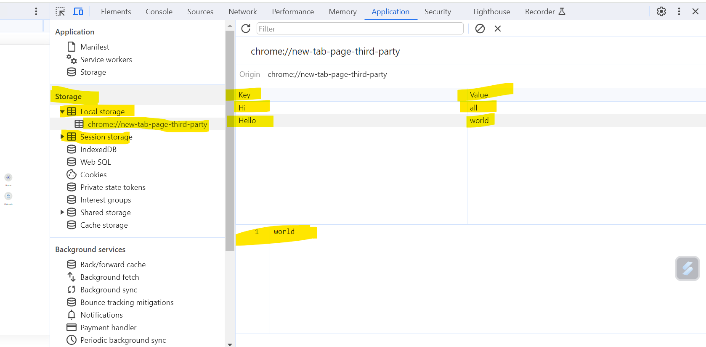
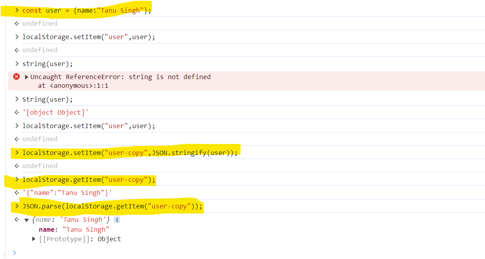
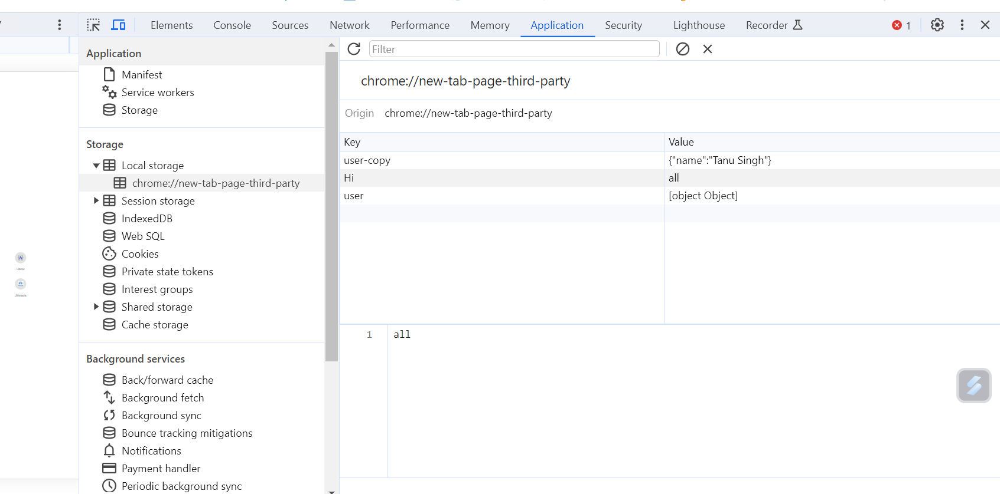
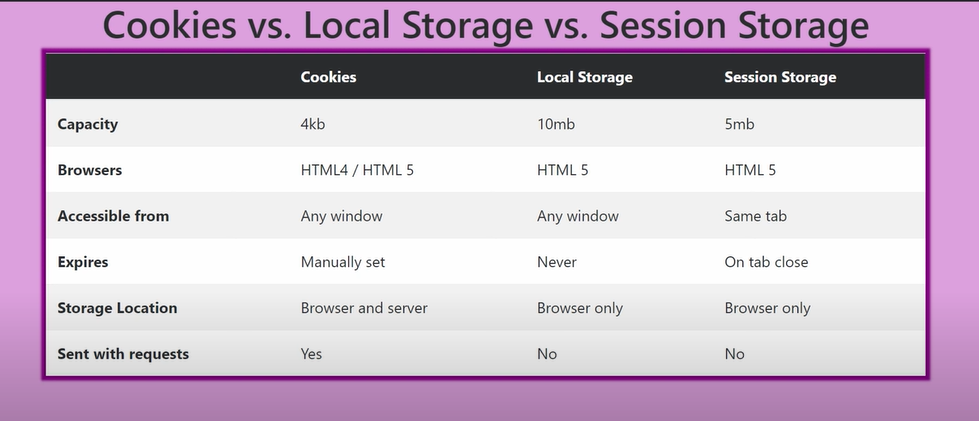

# Local and Session storage :

Local storage : when we shut down our PC and come back and visit the same page that we previously visited or either you close the tab. data will be present.

**Window is Global Object :**





```
Methods in Local Storage :
1. getItem()
2. setItem()
3. clear()
4. removeItem()

```

How will you set and get the item from the local storage?





**How to implement localStorage?**





**LocalStorage,SessionStorage and Cookies :**



```
https://blog.webdevsimplified.com/2020-08/cookies-localstorage-sessionstorage/

```
