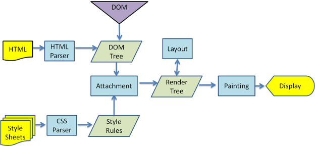

https://web.dev/articles/howbrowserswork

How to build build browser engine
https://limpet.net/mbrubeck/2014/08/08/toy-layout-engine-1.html

Viewport units:
https://www.sitepoint.com/css-viewport-units-quick-start/

vmin stands for viewport minimum. This unit is based on the smaller dimension of the viewport. If the viewport height is smaller than the width, the value of 1vmin will be equal to 1% of the viewport height. Similarly, if the viewport width is smaller than the height, the value of 1vmin will be equal to 1% of the viewport width.

vmax stands for viewport maximum. This unit is based on the larger dimension of the viewport. If the viewport height is larger than the width, the value of 1vmax will be equal to 1% of viewport height. Similarly, if the viewport width is larger than the height, the value of 1vmax will be equal to 1% of the viewport width.

Grid :
