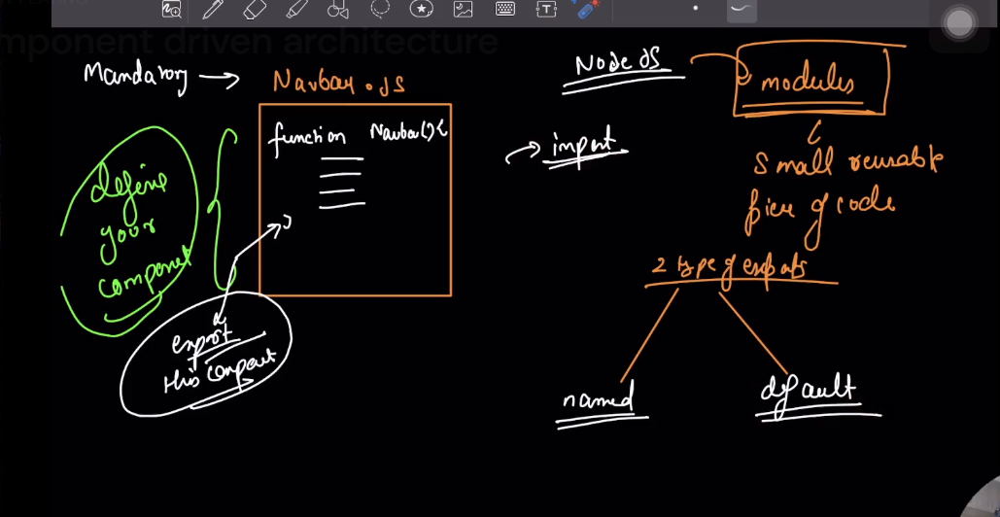

# Intro to create-react-app :

# npm Dependency resolution topological Sorting :

# Component Based Architecture :

# 2 types of Export

1. Named Export
2. Default Export

# Understand Fragments in React :

**Root with 

**

**Fragment with <></>**

# Props in React :

# Pre-defined Props :

