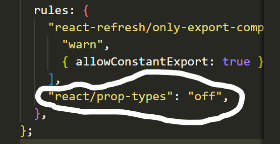

**Commands Used in this Project :**


# Material UI - React :

```
https://mui.com/material-ui/getting-started/
```

```
1. npm install @mui/material @emotion/react @emotion/styled

2. Roboto : npm install @fontsource/roboto

3. Icon :

npm install @mui/icons-material

```

**Dummy-api.io**

```
https://dummyapi.io/
```

```
https://dummyapi.io/explorer

https://web.postman.co/workspace/My-Workspace~379a0e85-99dc-492b-80a6-f7027af1bf2c/request/create?requestId=55c1f93a-233e-4074-8ec4-15525eb13328

```


**App-bar: Navbar**

```
https://mui.com/material-ui/react-app-bar/
```

**Add this in eslint file**

```
why we will use eslint file?

-> It makes our code clean.

```



**Using Axios in my Project:**

```
https://axios-http.com/docs/intro
```

```
npm install axios

```

```
HTTP request Methods :

1. Get
2. Put
3. Delete
4. Trace
5. Post
6. Head
7. Connect
8. Options
9. Patch

```
