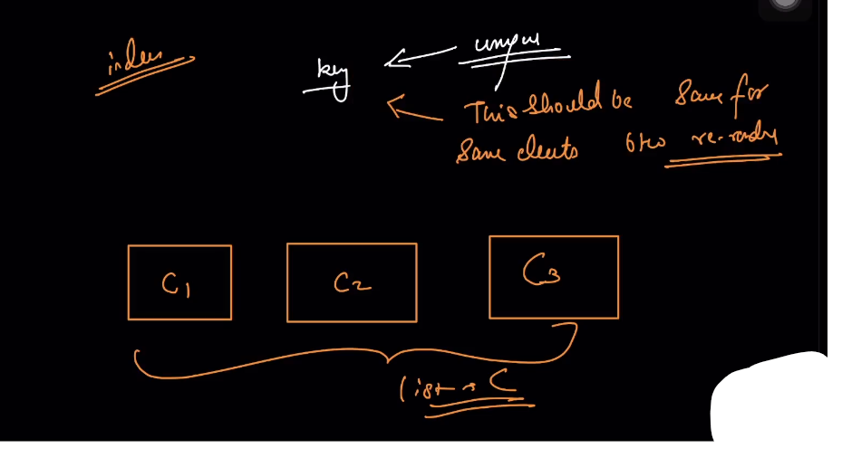

**State and Memory of Component**

**Understanding of map function :**

**Use of Map, filter and Reduce :**

**Key prop**

**when you click on onClick handler it will call function, but not immediately call :**

**Render and Commit**

