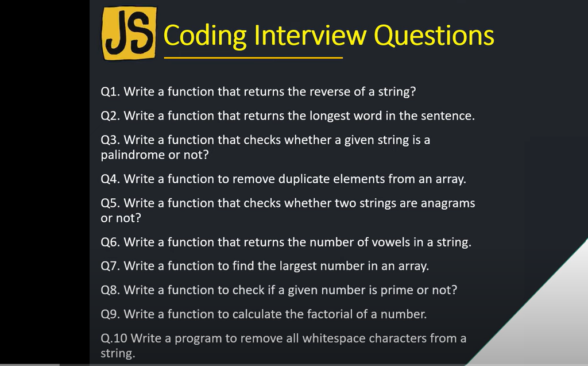
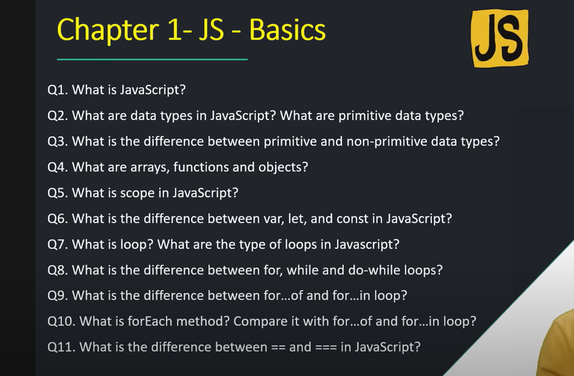
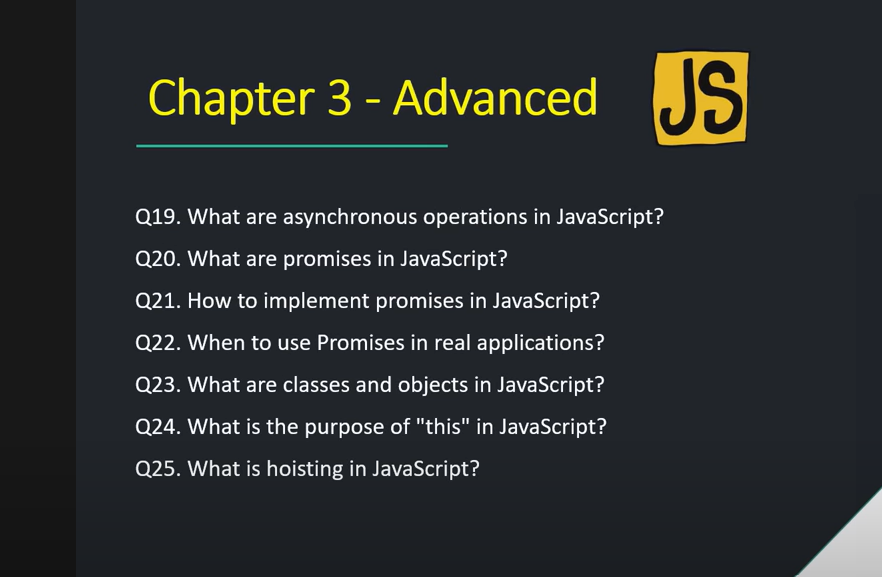

# Important coding questions of JavaScript :








**Above solution Link:**

```
https://www.youtube.com/watch?v=OEQpRTXfxoo
```

**complete JS:**

```
https://www.youtube.com/playlist?list=PL8p2I9GklV45z6Cov4omIOsbptPR1kxpg
```
