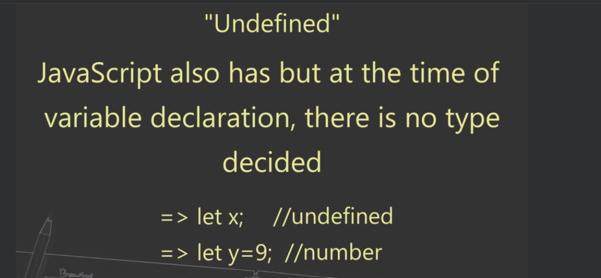
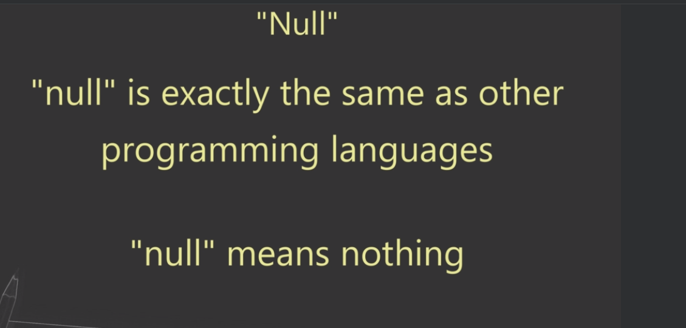
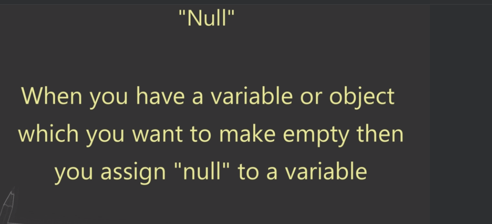
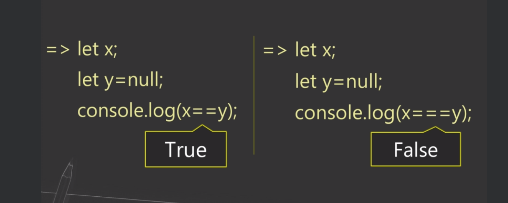
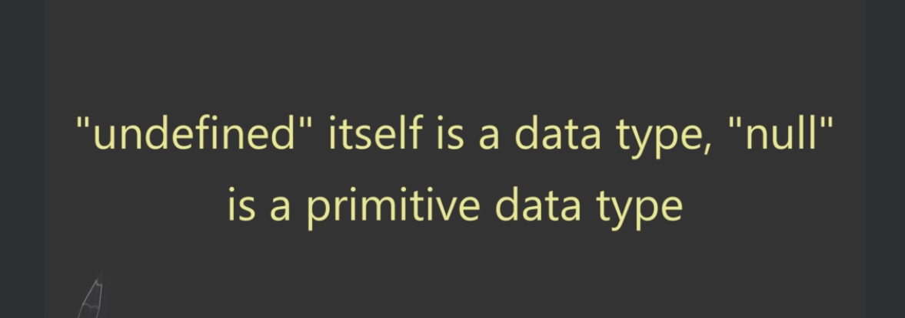

```
Q.1) What is "undefined" in JavaScript ?
Q.2) What will be the output of undefined==null & undefined===null ? Why ?
Q.3) Can you explicitly assign "undefined" to a variable ? (let i = undefined)
```










